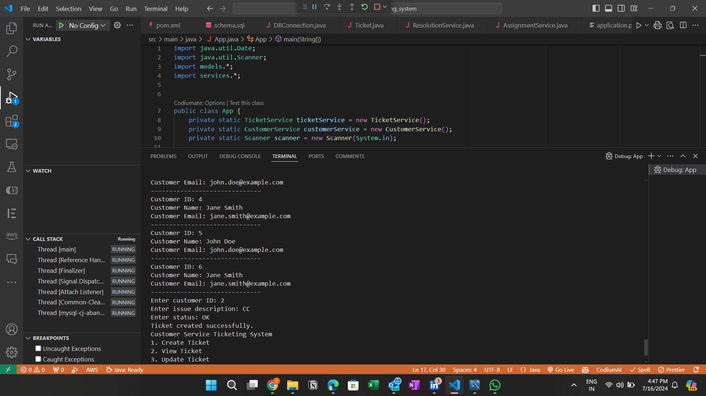
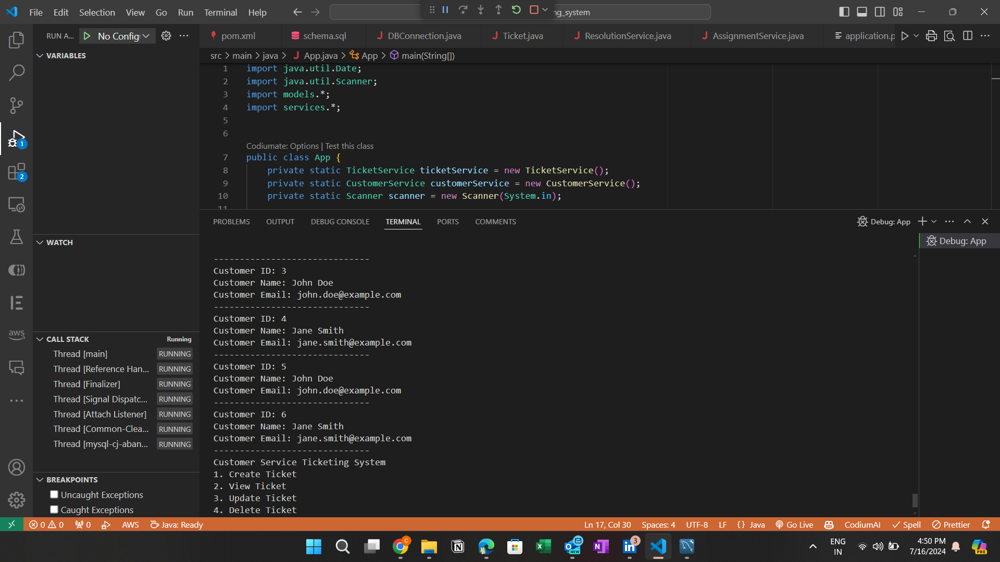
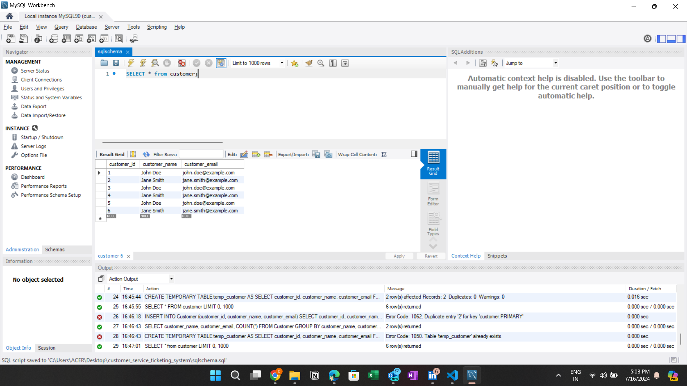

# Customer Service Ticketing System





## Overview

This project is a menu-based console application that simulates a customer service ticketing system for a consumer electronics company. The application allows users to manage customer inquiries, ticket assignments, and resolutions. It demonstrates proficiency in Core Java, MySQL, and JDBC.

## Functionalities

1. **Ticket Creation**:
   - Create a new customer service ticket
   - View ticket details
   - Update ticket information
   - Delete a ticket

2. **Ticket Assignment**:
   - Assign a ticket to a customer service representative
   - View assigned tickets
   - Update assignment information
   - Delete assignment records

3. **Ticket Resolution**:
   - Resolve a customer service ticket
   - View resolved tickets
   - Update resolution information
   - Delete resolution records

## Database Schema

### Ticket Table
- `ticket_id` (Primary Key)
- `customer_id` (Foreign Key references Customer Table)
- `creation_date`
- `issue_description`
- `status`

### Assignment Table
- `assignment_id` (Primary Key)
- `ticket_id` (Foreign Key references Ticket Table)
- `representative_id` (Foreign Key references Representative Table)
- `assignment_date`
- `status`

### Resolution Table
- `resolution_id` (Primary Key)
- `ticket_id` (Foreign Key references Ticket Table)
- `resolution_date`
- `resolution_details`
- `status`

## Setup Instructions

1. **Clone the Repository**:
   ```bash
   git clone https://github.com/yourusername/customer-service-ticketing-system.git
   cd customer-service-ticketing-system
